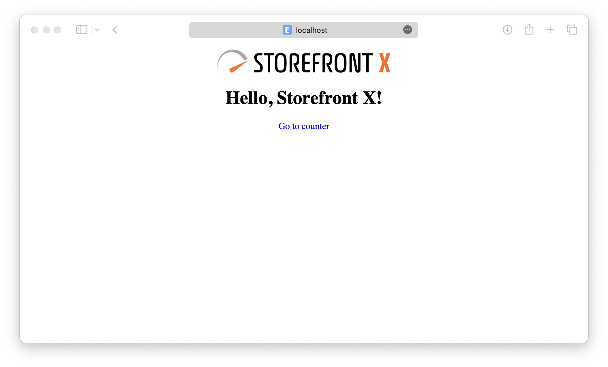
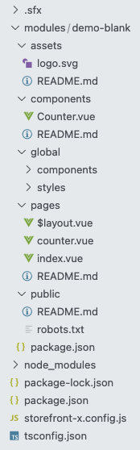
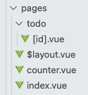
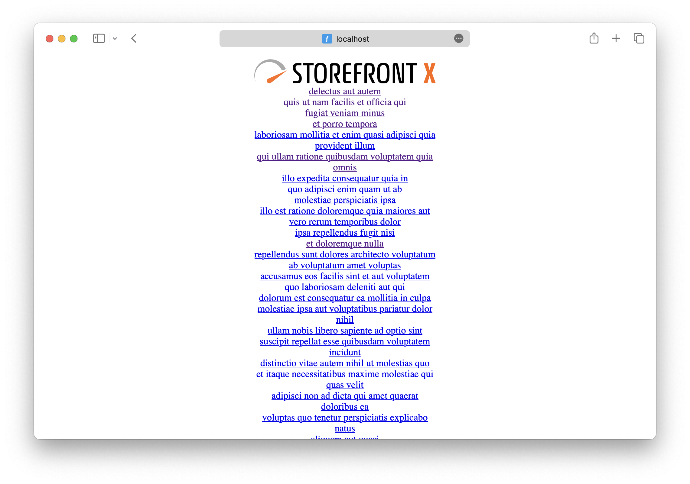
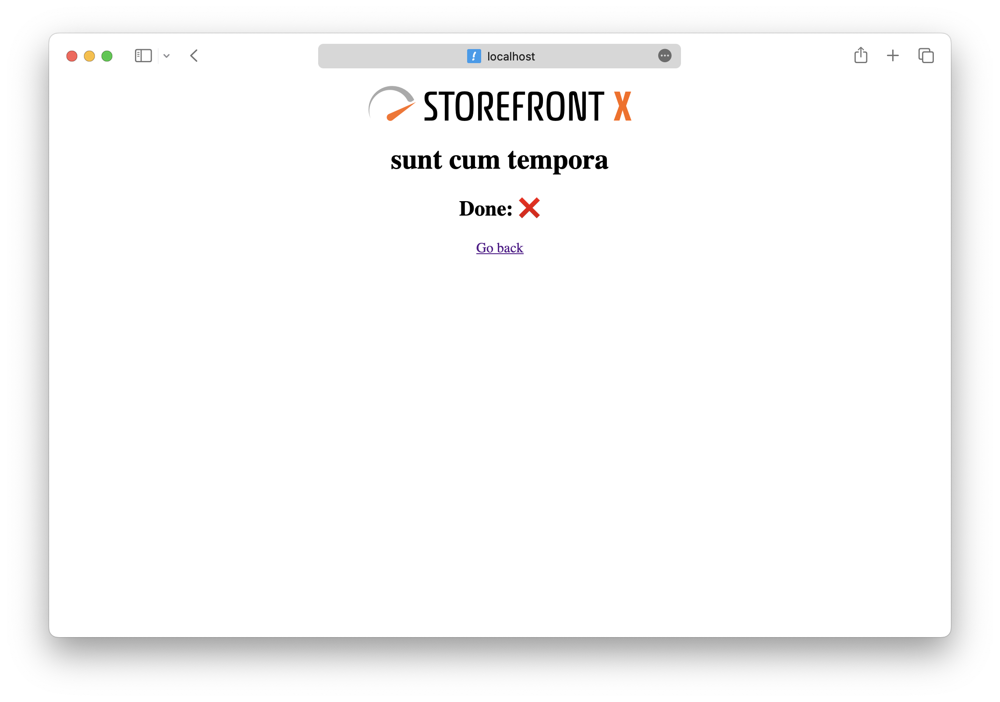

# Simple TODO app

In this tutorial, we will create a simple TODO app in Storefront X from scratch.

## Setup

Let's start with creating a new Storefront X application from a simple template.

:::tip
In this tutorial we will use the NPM package manager, but you can also use Yarn or any other package manager.
:::

```sh
npm create storefront-x@latest
```

Select a destination directory (or leave the default one) and than select the "Blank application" preset. After the application is generated inside the selected directory, you can `cd` into that directory and install necessary dependencies and start the application in development mode.

```sh
cd storefront-x-app
npm install
npm run dev
```

The application should now be running on localhost port 3000 and should look something like this:



## Structure

The generated code structure should look something like this:



There are few files and directories which will we gloss over for now. They are `storefront-x.config.js`, `modules` directory and `demo-blank` directory. The `modules` directory contains modules from which the application is made of (one application can be made from multiple modules). The `demo-blank` is currently our only module and the `storefront-x.config.js` says contains which modules are currently enabled. You can see there are few `storefront-x` modules (installed as dependencies from `package.json`) and our `demo-blank` module.

For now we will mainly focus only on the contents of the `demo-blank` directory because those files currently represent our application.

If you've seen other meta-frameworks like Nuxt.js or Next.js, you might be already familiar with some of these directories. As their names already indicates, the `components` directory contains components, the `pages` directory contains pages (file-based routing) and so on. You can also look at their readmes for more details.

:::tip
Hot module reloading in Storefront X works for everything except for changing the `storefront-x.config.js` config.
:::

## Imports

One more thing that needs to be explained beforehand are `#ioc` imports. If you open for example the `pages/counter.vue` page component, you can see that it imports the `Logo.vue` component with this import:

```js
import Counter from '#ioc/components/Counter'
```

As you can see, the `Counter.vue` component actually lives inside the `components` directory inside the `demo-blank` module. From this, you could deduce that the `#ioc` is an alias for our `demo-blank` module. In this case, the `#ioc` import actually leads to our module, but it's not the rule. The `#ioc` import may lead to any of the currently enabled modules (defined in `storefront-x.config.js`) which can be seen in `pages/$layout.vue` where the layout imports the `SfxLayoutOutlet` component, but this component is nowhere to be seen in our application. That is because this component comes from the `@storefront-x/vue-router` module.

How the `#ioc` import actually works will be explained later. For now you can image that it looks into all of the enabled modules and somehow chooses the module that contains the requested file.

## Fetching data

Lets now fetch data for our todo application. We will use the [JSON Placeholder](https://jsonplaceholder.typicode.com/) API.

Open the `pages/index.vue` page component and modify it like this:

```vue
<template>
  <div v-for="todo in data" :key="todo.id">
    <RouterLink :to="`/todo/${todo.id}`">
      {{ todo.title }}
    </RouterLink>
  </div>
</template>

<script setup lang="ts">
import useHead from '#ioc/composables/useHead'
import useResource from '#ioc/composables/useResource'
import { ref } from 'vue'

const title = ref('Hello, Storefront X!')

useHead({
  title,
})

const [data] = await useResource(
  () => 'https://jsonplaceholder.typicode.com/todos',
  (url) => fetch(url).then((response) => response.json()),
)
</script>
```

For data fetching, we use the `useResource` composable. It comes from the `@storefront-x/vue` module so it can be imported with the `#ioc` import.

The `useResource` composable takes two function as parameters. First function is responsible for gathering the input for the actual fetching logic in the second function. This needs to be separated so we can safely re-execute the first function to know if the input changed without re-executing the second function which would cause unnecessary network request. Thi first function uses [Vue.js watcher](https://vuejs.org/guide/essentials/watchers.html) so you can use refs, reactives or composables inside to make the data fetching reactive. How is this done will be shown later.

The second function of `useResource` composable takes output of the first function as input and fetches the data. This function is called only when needed to minimize number of network requests (for example data fetched on the server side during server side rendering won't be re-fetched on the client side).

The `useResource` composable is asynchronous so it needs to be awaited. It returns array with fetched data on the zeroth index.

We can then iterate over the data and render a link for every todo returned.

:::tip
The `useResource` composable is meant for downloading data. If you want to send a mutable request to your backend, you can use plain `fetch` inside of some event handler function.
:::

## New pages

Now we have page with links to our todos. These links look like this: `/todo/1`, `/todo/2`, `/todo/3`, ... If you clink on these links now, the 404 page will be displayed because we aren't handling this pages yet. Because we don't know all of the IDs during build, and we would like to handle all of these pages in one component, we will use parametrized page component.

First create a `todo` directory inside the `pages` directory and then add `[id].vue` file inside of it. The `[id]` represents parameter called `id` that will match anything, but because it is inside of the `todo` directory, it will match only URLs beginning with `/todo/`.



Inside this component with can add simple code to display the ID of the current todo:

```vue
<template>
  <h1>Todo {{ route.params.id }}</h1>
  <RouterLink to="/">Go back</RouterLink>
</template>

<script setup lang="ts">
import useRoute from '#ioc/composables/useRoute'

const route = useRoute()
</script>
```

The `useRoute` composable is the same as the `useRoute` composable from the [Vue Router](https://router.vuejs.org) library, but because it's provided by the `@storefront-x/vue-router` module, it is imported using the `#ioc` import. It returns information about the current route. And because this is parametrized route, with parameter named `id`, we can get the value of that parameter with `route.params.id`.

On this page we would like to download and show detail of the todo. We do that using the `useResource` composable.

```vue
<template>
  <h1>{{ data.title }}</h1>
  <h2>Done: {{ data.completed ? '✅' : '❌' }}</h2>
  <RouterLink to="/">Go back</RouterLink>
</template>

<script setup lang="ts">
import useRoute from '#ioc/composables/useRoute'
import useResource from '#ioc/composables/useResource'

const route = useRoute()

const [data] = await useResource(
  () => `https://jsonplaceholder.typicode.com/todos/${route.params.id}`,
  (url) => fetch(url).then((response) => response.json()),
)
</script>
```

Because `route` is reactive object used inside the first function of `useResource` composable, when the `id` route parameter changes, the fetcher (second function of `useResource`) will be automatically re-executed.

Our application should now have lis of all todos like this:



And detail of one todo like this:


