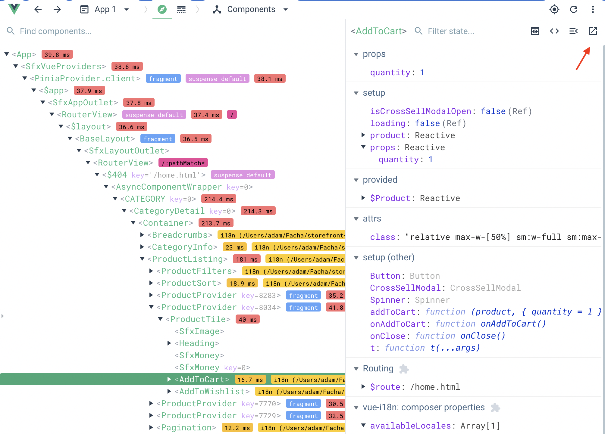

# Cookbook

## How to create new module

Modules in Storefront X are NPM packages. So they require `package.json` a need to be importable by their identifier. For local development, easiest way is to leverage monorepo functionalities. In root 'package.json', the `workspaces` fields specifies which directories are scanned for NPM packages. By default, it is a `modules` directory.

First, create new directory for the module in the modules directory and add `package.json`.

> `modules/my-module/package.json`

```json
{
  "name": "my-module",
  "version": "1.0.0",
  "license": "UNLICENSED",
  "type": "module"
}
```

:::tip
Why inside `modules` directory? Storefront X have to be valid NPM packages and are resolved the same way as installed NPM packages. In `package.json`, there is a `workspaces` field setting which directories NPM/Yarn searches for NPM packages (in addition to `node_modules`).
:::

Next enable the module in `storefront-x.config.js`.

> `storefront-x.config.js`

```js{9}
export default {
  modules: [
    '@storefront-x/base',

    '@storefront-x/vue',
    '@storefront-x/vue-router',
    // other modules

    'my-module',
  ],
}
```

And finally, you need to run `npm install`/`yarn install` so that the package manager can discover this newly added NPM package and resolve it. After each modification of `storefront-x.config.js` you need to restart the development server (`yarn dev`) or build the application for production use (`yarn build`).

To test that everything works, we can for example add test page to our module.

> `modules/my-module/pages/test.vue`

```vue
<template>
  <h1>Hello from my module!</h1>
</template>
```

This page should now be visible under the `/test` URL.

## How to override a component

First, you need to know, which component to override and what's its relative path the root of its module (e.g. `atoms/Button.vue`). For this you can either use the `.sfx/ioc/` directory (more info [here](/general/sfx)), or you can use [Vue devtools](https://devtools.vuejs.org).



After you located your component, create new file with the same name and in the same directory as the component you want to override in your module. This module has to be loaded after the module in which the original component is located.

### Example

Original component: `theme-tailwind/atoms/Button.vue`

New component: `my-module/atoms/Button.vue`

```javascript
export default {
  modules: [
    // some modules...
    '@storefront-x/theme-tailwind',
    // some modules...
    'my-module',
    // some modules...
  ],
}
```

In development mode, overridden component is hot-module-reloaded so no need to restart dev server. But for the production build, you will need to rebuild the application.

:::tip
Same way you can override basically any file, not only components.
:::

## How to display data from backend

### 1. Create new mapper

We need mapper to sanitize data returned from backend. We also use mappers to provide use with type information.

> `mappers/ToTodo.ts`

```ts
export default (data: any) => ({
  id: data.id as number,
  title: data.title as string,
  done: (data.completed ?? false) as boolean,
})
```

:::info
A mapper is higher-order function (function that returns another function), because it is also a composable so it can use other composables in the first function.
:::

### 2. Create new repository

We need repository for communication with backend. In this repository we can use `fetch` method or some adapter (e.g. `useShopware`). In this example, we will display a todo from the [JSON placeholder](https://jsonplaceholder.typicode.com).

> `repositories/useGetTodoRepository.ts`

```ts
import ToTodo from '#ioc/mappers/ToTodo'

export default () => {
  return async (id: string) => {
    const response = await fetch(`https://jsonplaceholder.typicode.com/todos/${id}`)
    const json = await response.json()
    return ToTodo(json)
  }
}
```

### 3. Create new service

Service wraps repository and adds business logic. A lot of the times there might not be additional business logic so services might be basically empty.

> `services/useGetTodo.ts`

```ts
import useGetTodoRepository from '#ioc/repositories/useGetTodoRepository'

export default () => {
  const getTodoRepository = useGetTodoRepository()

  return async (...args: Parameters<typeof getTodoRepository>) => {
    return await getTodoRepository(...args)
  }
}
```

### 4. Fetch data in component

When fetching data that should be rendered on the page, we can't call the service normally. We have to call it inside `useAsyncData` composable. If called on the server during server-side rendering, this composable stores fetched data and transfers them to the browser so that browsers has access to the same data and doesn't have to do any additional requests.

> `pages/todos/[id].vue`

```vue
<template>
  <h1>{{ todo.title }}</h1>
</template>

<script setup lang="ts">
import useRoute from '#ioc/composables/useRoute'
import useAsyncData from '#ioc/composables/useAsyncData'
import useGetTodo from '#ioc/services/useGetTodo'

const route = useRoute()
const getTodo = useGetTodo()

const { data: todo } = await useAsyncData('todo', () => getTodo(route.params.id as string))
</script>
```
